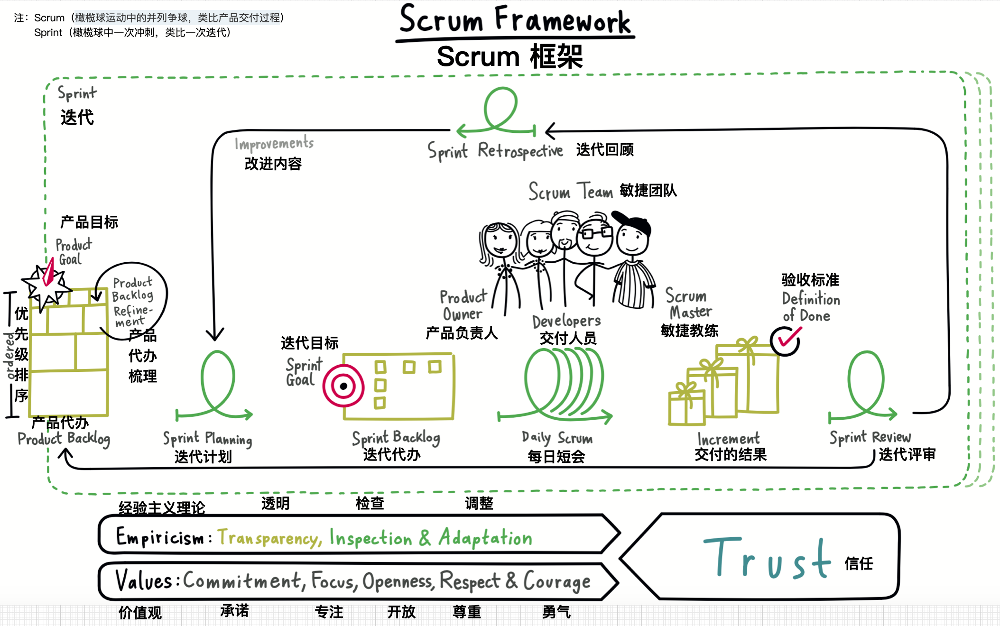

# 软件持续交付管理
实现持续交付不仅仅是买些工具，做一些自动化的工作。它依赖于交付过程中所涉及的每个人的协作，来自行政管理层的支持，以及基层人员的改进意愿。

持续交付不仅仅是一种新的交付方法论。对依赖于软件的业务来说，它是一个全新的范例。

CIMA把企业治理（enterprise governance）定义为“由董事会（board）和执行管理层行使的一系列职责和实践，其目的是提供战略方向，以确保达成业务目标，风险被合理地管理起来，并验证组织的资源被可靠地使用了”。企业治理更关注于符合度（conformance），即从遵从性、保障、监管、责任和透明管理，而业务治理（business governance）更关注业务和价值创造的执行度（performance）。

一方面，为了收入的持续增长，业务人员希望尽早得到有价值的新软件。另一方面，负责企业治理的人希望确保公司了解可能导致业务损失或破产的任何风险，并确保有管理这些风险的手段和流程。

尽管在业务方面，每个人最终都是为了一个共同的目标，但在执行度和符合度方面经常会成为互相冲突的力量。这一点已经从有尽快交付压力的开发团队与把任何变更都看作风险的运维团队之间的关系看出来了。

在组织中的这两部分人不要再进行零和博弈了。其实，执行度和符合度都可以满足。通过确保交付团队能得到应用程序在类生产环境上的不断反馈，是部署流水线达成“执行度”这个目标的方法和手段。

部署流水线使交付流程更加透明，来帮助团队达成符合度。IT部门和业务部门能够在任意时刻利用自服务方式，将应用程序部署到UAT环境来试用它（比如测试一些新特性）。为了审计目的，部署流水线还提供系统记录，标记出应用程序的每个版本已经到了交付流程中的哪个阶段，并能够追溯每个环境中运行的应用程序对应于版本控制库的哪个修订版本。在这方面，很多工具都提供了相应的功能来记录谁能做什么事，以便只能由被授权的人来执行部署。

持续交付工程实践，尤其是增量交付和自动化构建、测试和部署流程，都是用来帮助管理软件新版本发布风险的。全面的测试自动化在应用程序的质量方面为我们提供了更高的信心指数。部署自动化提供了一种能力，可以做到一键式发布和回滚。而使用一致的过程向每个环境进行部署，以及自动化的环境、数据和基础设施管理，这样的实践来确保发布过程是经过彻底测试、人为出错机率最小，而且在发布之前，任何问题（如功能、非功能或配置相关的问题）都已经被发现了。

使用这些实践后，即使开发复杂软件的大型组织也可以快速且可靠地交付新版本了。也就是说，不仅业务部门可以从投资中得到快速回报，而且还能减少风险，消除因较长开发周期（甚至更糟，最终交付的软件无法满足其业务目标）所产生的机会成本。像精益制造业一样，没有频繁交付的软件就是仓库中的库存，它已经花钱制造完了，却还没有为你赚钱，实际上保管它也是花钱的。

> 零和博弈又称零和游戏，与“非零和博弈”相对，是博弈论的一个概念，属非合作博弈，指参与博弈的各方，在严格的竞争下，一方的收益必然意味着另一方的损失，博弈各方的收益和损失相加总和永远为“零”。双方不存在合作的可能。

## 项目生命周期
每个软件开发项目都是不同的，但不难从中抽取出共同元素。尤其是，我们可以抽象出一个软件交付的生命周期。
团队组建与磨合常常会经历五个阶段：创健期（forming）、风暴期（storming）、规范期（norming）、运转期（performing）和调整/重组期（mourning/reforming）。同样，软件也会经过几个阶段，初步可包含以下阶段：识别阶段（identification）、启动阶段（inception）、初始阶段（initiation）、开发和部署阶段（development and deployment）及运维阶段（operation）。

> **创建期（forming）** 指团队开始形成，团队成员开始互相了解，而不是特别关注工作，这时候效率是低下的。**风暴期（storming）** 指头脑风暴，即团队成员花大量时间讨论如何领导，如何分配工作，怎样工作，还有达到的目标，效率低下。**规范期（norming）** 指团队确定了决策流程，并开始规范自己的行为，开始关注怎样工作能最好的达到目标，效率上升。**运转期（performing）** 指团队开始有效率的工作，并在工作中避免个人冲突，团队成员懂得怎样做决定和工作，效率很高。**调整/重组期（mourning/reforming）** 指经过一段时间的运转后，团队出现种种新的问题，进行调整和重组过程，如此循环往复。

### 识别阶段
大中型组织都会有治理策略（governance strategy）。业务部门会决定策略目标，并识别一系列需要做的计划任务，以便完成策略目标。这些计划任务会被分解成多个项目。
然而在我们的经历中，常常发现，IT项目经常不做业务分析（business case）就启动了。这样可能导致失败，因为没有做业务分析，就不可能知道项目如何算成功。你也就成了《南公园》中收集内裤的侏儒了，他的策略如下：
（1）收集内裤。
（2）？
（3）收益。
没有业务分析，需求收集工作就很艰难，同时也无法客观地排列需求优先级（这对企业内部服务也是一样的）。即使做了，可能最后开发出来的应用程序或服务也与你在最初需求收集时所想的解决方案相差很大。

在开始需求收集之前，还有一样东西要准备好，即利益干系人列表，其中最重要的是业务主要负责人（business sponsor）。每个项目应该只有一个业务主要负责人。否则，在项目还没有完成之前，就会在政治内讧中失败。这个业务负责人在Scrum中叫做Product Owner，在其他敏捷形式中就是指客户业务的负责人。IT项目的其他内部干系人包括运维、销售、市场和技术支持人员，以及开发和测试团队。这些干系人都要参与项目的下一个阶段-启动阶段。

> [Scrum](https://www.scrumguides.org/scrum-guide.html)是一个轻量级的框架，可以帮助团队和组织通过适应性解决方案解决复杂问题，产生价值。

### 启动阶段
“启动阶段”是对开始写产品代码前这段时间最简单的描述。一般来说，此时会对需求进行收集和分析，并对项目的范围和计划进行初步规划。人们很容易认为这一阶段是低价值的而跳过它。然而，从实践中得出的结论：软件项目要想成功，就要对这个项目进行细心的规划和执行。

这一阶段有很多种交付。根据方法论和项目类型的不同，这些交付物会有差异。然而，大多数启动阶段会有下列产出：
* 商务分析报告，包括该项目的价值评估。
* 概括性的功能与非功能需求列表（包括容量要求、可用性要求、服务连续性要求和安全性要求），需求的详细程度足以估算工作量和做项目计划即可。
* 发布计划，其中包括工作时间安排表和与项目相关的成本。为了得到这个信息，通常会评估需求的相对大小，所需的编码工作量，以及每个需求相关的风险和所需人力资源计划。
* 测试策略。
* 发布策略。
* 架构评估报告，决定使用什么样的平台和框架。
* 风险和问题列表。
* 开发生命周期的描述。
* 执行上述内容的计划描述。

这些交付物应包括足以启动项目的细节以及最多几个月后需要交付的目标，如果可能的话，短点儿更好。根据我们的经验，合理的最长周期是三到六个月（倾向于三个月的期限）。在启动阶段结束前，应该根据对项目的估计收益、预计成本和已预期的风险等因素，给出该项目是否需要继续进行的明确决定。

该阶段最重要的部分（也是决定项目成功概率的部分）是让所有项目干系人在一起面对面的工作，包括客户、开发人员、运营人员和管理层。这些人之间的对话才是真正的交付物，因为这会让所有人对需要解决的问题域，以及解决问题的方法有一个共同的理解。上面的清单用于设计和引导这种对话，以便能够讨论重要的问题，识别风险，并制定风险对策。

这些交付物应该被记录下来。然而，由于它们是活（living）的文档，所以在整个项目进程中每个产物都可能发生变化。为了以可靠的方式追踪这些变化（以便每个人都能轻松地看到当前的状况），应该将这些文档提交到版本控制库中。

注意，这个阶段所做的每个决定都是基于推测的，将来会发生变化。这些产出物都是基于当时所能获得的一小部分信息做出的最合理猜想。在项目的这个阶段，由于你所能掌握的信息很少，所以花过多精力是错误的。这个阶段的内容都是一些重要的计划讨论和目标设定。随着项目的进展，其中很多内容需要提炼或重新定义。在一个成功的项目中，对这些内容的变更处理也一定做得非常好。那些试图避免变更的项目常常以失败而告终。在项目的这个阶段进行非常详尽的计划、估算和设计就是在浪费时间和金钱。

### 初始阶段
在启动阶段之后，就应该建立初始的项目基础设施了。这个初始阶段一般需要一周到两周的时间。下面是该阶段中典型的活动。
* 确保团队（分析师、经理和开发人员）可以得到开发所需的所有软硬件。
* 确保基本的基础设施都准备好了，比如因特网连接、白板、笔和纸、打印机、食物和饮料等。
* 创建电子邮件账号，为大家指派访问各类资源的权限。
* 建立好版本控制库。
* 建立一个基本的持续集成环境。
* 在角色、职责、工作时间和会议时间（比如站立会议、计划会议和演示会议）上达成一致。
* 为第一周做准备工作，并在目标（不是指“最后期限”）上达成一致。
* 创建一个简单的测试环境和测试数据。
* 稍微更详细地研究一下预定的系统设计：在这一阶段探究它的可行性是真正的目标。
* 做一些调研（为了验证对某个具体需求的设计而做的实现），识别和缓解任何分析、开发和测试风险。
* 梳理用户故事或需求的代办列表（Backlog）。
* 创建项目结构，使用最简单的用户故事（与hello world差不多），包括一个构建脚本和一些测试，从而验证持续集成环境可以正常工作。

安排足够的时间从容地完成这些工作是至关重要的。如果没人知道对将要开发的最初需求的验收条件，或者团队成员没有好用的计算机和工具以及因特网接入不畅，还执意开始工作的话，那一定是低效的，团队士气也会低落。

虽然这个阶段的真正目标是准备好基本的项目基础设施，而且也不应该被看成是一个真正的开发迭代，但是拿一个真实的需求让整个基础设施运行起来是非常有用的。建立一个测试环境却无内容可测，或者建立一个版本控制库却无内容可存，这是一个既没有产出也很低效的开始。与此相反，要找到一个实际的（也许是最简单的）需求，解决一个实际的问题，并建立一些初始的设计方向。用这个需求实现来证明能够进行正确的版本控制，并且在持续集成环境中可以运行测试，再将结果部署到一个手工的测试环境中。其目标是完成这个需求并可以演示，并在初始阶段结束时，建立所有的支撑性基础设施。

一旦你做完了这些，就可以开始真正的开发工作了。

### 开发与发布

当然，我们推荐以迭代增量式过程进行软件的开发与发布。不适用这种方式的唯一情况就是那种大型且涉及多个相关方的国防项目。然而，即便是太空船软件，也是利用迭代过程实现的。虽然很多人都认同迭代过程能带来益处，但是，我们经常看到的事实是，团队声称自己做的是迭代开发，但实际上完全不是那么回事。因此，有必要重申一下，我们认为下列信息是至关重要的，而且是迭代过程的最基本要求。
* 软件应该一直处于可工作状态，因为每次签入代码时，都会运行自动化测试套件，包括单元测试、组建测试以及端到端的验收测试。
* 每个迭代都能将软件部署到一个类生产环境中，并向用户演示（这样可以确保整个过程不但是迭代式的，而且是增量式的）。
* 迭代长度不超过两周

使用迭代过程的理由有如下几个：
* 假如按业务价值来排功能优先级，你会发现，远在项目结束之前，软件就已经生效了。当然，即使我们已经完成了一些功能，也经常有一些很好的理由不发布新软件。然而，除了让用户使用上可以工作的软件这种方式以外，没有哪种方式更能将用户对项目失败的担心转化成对看到新功能的兴奋。
* 可以从客户或者出资人那里得到关于软件的反馈，比如什么需求被满足了，什么需求还需要澄清或修改。这也意味着，正在开发的功能的确是有价值的。可在项目开始时，没人知道，他们真正想要的是什么。
* 只有客户签收（sign off）后，需求才是真正算完成了。而定期给客户做软件演示是跟踪进度唯一的可靠方式
* 保持软件随时可工作（因为你不得不做演示），这会让团队更有纪律性，以避免集成阶段时间太长、破坏原有功能的重构和失去焦点及方向感。
* 可能最重要的是，强调每次迭代结束后都能得到可部署到生产环境的代码。在软件项目中，这是唯一真正有用的过程度量项，也只有迭代方法能提供这种方式。

“不做迭代开发”的一个常见理由就是：在很多功能没有完成之前，整个项目是无发交付价值的。虽然对于很多项目来说，这种限制可能是很现实的，但是，上面列表中最后一项正好与这种情况相对应。当管理没有使用迭代开发方法的大型项目时，所有关于项目进展的度量都是主观的，根本没有办法确认项目的真正进度。在非迭代方法中看到的那些漂亮图表都是基于所剩时间的估算和对后续集成、部署和测试阶段中风险与成本的猜测。迭代开发提供的是项目进展情况的客观度量，它是用开发团队能够供给用户可工作的软件，并且该软件完成了多少被用户认可，满足用户目标的功能来衡量项目的进度。只有已准备好能够部署到生产环境的代码，那些你可以与之交互的代码（即便只是在一个UAT环境），才能保证指定功能是真正完成了的。

至关重要的是，“准备好部署到生产环境”也意味着该软件已利用生产环境相同大小的数据集，在类生产环境中进行了非功能需求测试。你所关心的任何非功能需求（比如容量、可用性、安全性等）都应该利用真实的负载和使用模式来测试。这些测试应该是自动化的，每次通过验收测试后就运行这些软件构建，以便确保软件总能满足要求。

迭代开发过程的关键在于划分优先级和并行化。工作应该被划分优先级，以便分析人员开始分析最有价值的特性，然后把工作交给开发人员，之后是测试人员，最后是给真正的用户。利用来自精益制造的一些技术，这一工作可以并行进行，而且可以对每个任务上的工作人数进行调整，以便移除瓶颈。这样就会形成一个非常高效的开发过程。

进行迭代增量式开发有很多种方式。最流行的方式之一就是Scrum，它是一种敏捷开发过程。Scrum在很多项目上成功了，但我们也看到过它失败。而失败的原因主要有如下三个：
* 缺乏承诺。向Scrum转变的过程是一个很容易出乱子的过程，尤其对于项目的领导力来说。确保每个人都能对项目的进度进行定期的面对面讨论，建立定期的回顾会议来分析项目运行情况，并寻找改进点。敏捷过程依赖于透明性、协作性、纪律性和持续改进。在实施敏捷过程中，会突然释放出一些有用信息，将原来隐蔽起来不便得到的真相推到聚光灯下。关键在于，要认识到这些问题本来就一直存在。现在只是暴露出来，让你知道了，这样就可以解决它们了。
* 忽视好的工程实践。假如Scrum执行者忽略了技术实践（比如测试驱动开发、重构和持续集成），会出现很糟糕的情况。如果代码基础被缺乏经验的初级开发人员搞坏了，任何开发过程都无法自动修复它。
* 将敏捷开发过程进行适应性调整，直到这个过程不再敏捷了。有些人对敏捷过程进行裁剪，令它成为他们成为他们认为能更好地适应他们组织需要的过程是很常见的现象。然而，敏捷过程中的各种要素以完整的逻辑闭环互相作用，确实了个别关键要素，导致逻辑闭环无法运转。

对诺基亚公司来说，这最后一点给它们带来了很多麻烦。因此，它建立了一个检查清单，用于评估它的团队是否在真正使用Scrum。这个检查分成如下两部分：
* 你在做迭代开发吗？
  * 迭代周期必须少于四周，而且要固定时长。迭代越短反馈越灵敏。
  * 在每个迭代结束时，软件功能必须被测试完成，并能够正常工作。
  * 在规格说明书写完之前，迭代必须开始。

* 你在使用Scrum吗？
  * 你知道谁是Product Owner吗？
  * 产品代办列表是按业务优先级排列的吗？
  * 产品代办列表是由团队估算的吗？
  * 项目经理或其他人是否干扰了团的的工作？

为了澄清最后一点，我们认为，项目经理应该管理风险、移除障碍（比如资源缺乏、帮助高效地交付），扮演非常有用的角色。然而，的确有些项目经理根本不做这些事情。

### 运营阶段
一般来说，第一次发布不可能成为最后一次发布。接下来会发生什么，很大程度取决于项目本身。开发和发布过程可能会一直全速持续下去，也可能团队规模会减小。如果该项目原来是一个试验项目，可能会发生相反的情况，团队规模会变大。

迭代和敏捷过程中有一个非常有趣的现象，即在很多方面，项目的运营阶段与常规开发阶段没有什么不同。如前所述，大多数项目不会止步于首次发布，而会开发新的功能。有些项目还会有一系列的维护性发布，可能是修复那些在发布前未能预料到的问题，可能是对软件进行修改以满足新发现的用户需求，还可能是滚动开发计划的一部分。此时，要识别新特性、排定优先级、分析、开发、测试和发布。这与项目的常规开发阶段没有什么不同。从这方面来看，将这些阶段合并在一起是消除风险的最佳方法之一。

对于某个具体的系统来说，将其发布时间尽可能提前到对其有意义的时间点是非常有用的。你能得到的最佳反馈是从真正的用户那里来的，这里的关键是尽早将软件发布给真正的使用者。然后，你就能对软件可用性等方面的反馈以及其他任何问题尽快的做出反应。虽然如此，在系统发布之前和之后，项目各阶段之间还是有所不同的。一旦首次公开发布后，变更管理，尤其是对于应用程序生成的数据以及他的公开接口的变更，就变成一个非常重要的问题。

## 风险管理流程
风险管理是一个过程，它确保：
* 项目的主要风险已经被识别；
* 已有适当的缓解策略对这些风险进行管控；
* 在整个项目过程中，持续识别和管理风险。

风险管理过程是应该有如下几个关键特征：
* 一个项目团队汇报项目状态的标准结构；
* 项目团队依赖标准，定期更新进度状态；
* 有一个信息展示板，可以跟踪当前状态，并查看所有项目的趋势；
* 项目外的人员定期对项目进行审计，确保风险被有效地管理起来了。

### 风险管理基础篇
值得注意的是，并不是所有的风险都需要缓解策略。对于那些灾难性的事件，没什么方法可以用来缓解。比如，一个巨大的小行星会摧毁地球上的所有生命就是一个极端例子，但你一定已经理解我说的是什么意思了。经常会有一些很现实的、项目所特有的风险，会导致项目被取消，比如立法或经济变化，组织管理结构的变更，或者项目关键发起人离职等。制定和实施成本太高或时间消耗太长的缓解策略也是没有必要的，比如对于某个小公司的工时和票据管理系统来说，一个多地区节点的备份系统是没有必要的。

风险管理的一个常见模型是根据风险的影响（如果一旦发生，它们会引起多少损失）以及其可能性（风险有多大的可能成为事实）对风险进行分类的。二者结合在一起来评估每个风险的严重程度。从经济方面来考虑影响是最容易的：如果这个风险成为现实，会损失多少钱？然后再将该风险的可能性指定为0（不可能）到1（必然）之间的某个数值。把严重性产生的影响（就是损失的金钱）与可能性相乘，得到的金钱数就是对风险严重性估值。这样，可以通过非常简单的计算决定使用什么策略来缓解风险：缓解策略的成本是否高于风险的严重度？如果回答是肯定的，那么缓解策略可能就没有必要实施了。

### 风险管理时间轴
根据项目生命周期模型，风险管理过程应该在启动阶段结束之前就开始了，并在初始阶段结束时进行重新审视，然后在整个开发和部署阶段中定期进行审视。

1. 启动阶段结束时
在这一阶段的最后，有两种重要的交付物。首先就是发布策略，它是在该阶段创建的。
第二种交付物是对初始阶段的计划。有时候在启动阶段和初始阶段间会有一段空闲期。此时，该计划在初始阶段的前几天做完就行。否则的话，初始阶段结束时就应该完成整个计划的制定。

2. 初使阶段结束时
这里的关键是确保团队已经准备好开始开发软件了。持续集成服务器应该已经运行了，并能够编译代码和运行自动化测试套件。而且，还应该有一个类生产环境，可以用于产品代码的部署。用于描述应用程序的功能和非功能（尤其是容量）需求是如何通过部署流水线中的自动化测试套件的测试策略也应该到位了。

3. 开发和发布风险的缓解
即便做了最充分的准备工作，开发和部署阶段也会有很多方式可能走向错误的一端，有时可能比你想的还要快。我们曾经历或听说过一些关于直到部署日期之后オ交付代码，或者刚部署就由于容量问题而失败的项目。在整个阶段中，你要不断问自己一个问题：“有什么会出错？”假如你没有自己这个问題，当事情发生时，你就会不知所措。

在很多方面，风险管理的真正价值在于它为软件开发建立了一个上下文环境，并且对开发活动产生一种深思熟虑的有风险意识的方法。作为一个团队，考虑哪些地方会出错也许能发现一个有可能被遗漏的具体需求，它也让我们足够重视某个风险，并在该风险成为问题之前避免这种后果的发生。如果你认为第三方供应商可能会错过最后期限，那么就会提前监控他们的进度，从而在最后期限到来之前有时间重新调整计划，以适应当时的状况。

在该阶段，你的目标是识别、跟踪和管理所有你认为可以被管理的风险。有如下几种方法来识别风险。
* 查看部署计划。
* 每次演示之后都做一下简短的回顾会议。在这个会议上，让团队对项目风险进行头脑风暴。
* 让风险识别成为每日立会的一部分。

### 如何做风险管理的练习
不要去干扰一个能够按计划定期交付软件的团队（尽管它可能会有几个缺陷），这ー点非常关键。然而，更重要的是，快速发现那些从外部看来一切都很好，而实际上正在走向失败的项目。幸运的是，迭代开发方法的收益之一就是，很容易就能发现这样的问题是否存在。如果你正在进行迭代开发，那么每个迭代结東时你都应该在类生产环境中演示一下这个可工作的软件。这是实际进度的最佳证明。因为你的团队生产出了真正可执行的代码，并对真正用户进行演示并部署到类生产环境中，这个结果不会说谎，虽然这种进度也是估计的。

让我们用它与非迭代开发方法或迭代周期很长的迭代开发对比一下。在使用后者的项目中，必须深入了解团队工作的细节，查看不同的项目文档和跟踪系统才能真正发现还剩多少工作需要完成。一旦完成这种分析之后，你就要依据现实情况来验证分析后得到的结果，而这是一个极其困难且不可靠的过程。

分析任何项目，最好是从下面这些问题出发（对我们来说，这个列表在多个项目里都非常有效）。

* 如何跟踪项目进度？
* 如何防止缺陷？
* 如何发现缺陷？
* 如何跟踪缺陷？
* 怎么知道一个用户故事做完了？
* 如何管理环境？
* 如何管理配置项，比如测试用例、部署脚本、环境和应用程序配置、数据库脚本和外部库？
* 演示可工作功能的频率是怎样的？
* 做回顾会议的频率是怎样的？
* 运行自动化测试的频率是怎样的？
* 如何部署软件？
* 如何构建软件？
* 对运营团队来说，如何确保发布计划是可行的且可接受的？
* 如何确保风险问题列表是及时更新的？

这些问题并不是一种规范，这一点非常重要，因为每个团队都要有一定的灵活性根据他们的具体需求来选择合适的流程。相反，这些问题都是开放性的问题，确保你尽可能多地得到关于项目上下文和所用方法的相关信息。而且，这些问题更关注于产出物，所以你能验证团队是否真的能够交付，而且也能找到一些警示信号。

## 常见的交付问题、症状和原因

在此部分，我们会描述一些在软件的构建、部署、测试和发布过程中常见的问題。尽管任何事情都有可能让项目失败，但有些事情比其他事情更可能导致失败。通常很难找出项目到底出了什么问题，你能看到的只是症状。当出问题时，找出怎么能更早地发现它，并确保这些症状都被监控到了。

一旦看到这些症状，你需要寻找并发现根因，因为任何症状都可能是很多可能的潜在原因的一种表象。为了找到根因，我们使用了一种叫做“根因分析”的技术。对于一个非常简单的过程来说，这是个非常华丽的名字。而当面对一系列的症状时，只要像小孩儿那样，重复向团队问“为什么”，并至少五次就行了。尽管这个过程听上去似乎非常荒唐，但我们发现，它非常有用，而且十分简单。

一旦知道了根本原因，你就要真正来解决它。所以，我们在这里直接列出常见的症状，并依据其根本原因进行了分组。

### 不频繁的或充满缺陷的部署
1. 问题
  - 时间部署某个构建版本，而且部署过程很脆弱。
2. 症状
  - 测试人员花很长时间才能将缺陷记录关闭。注意，这个症状可能并不是完全由不频的部署导致的，但它是可能的原因之一。
  - 对用户故事的测试或者被客户验收需要花很长时间。
  - 测试人员正在找的 bug 是开发人员很长时间之前修复的。
  - 没有人信任 UAT、性能或持续集成环境，当某个版本发布将要发布时，人们仍旧表示怀疑。
  - 很少做演示。
  - 应用程序很少被证明是可以工作的。
  - 团队的速率（进度）比预期的慢。

3. 可能的原因

有很多种可能的原因。下面是最常见的一些原因。

- 部署过程是非自动化的。
- 没有足够的硬件。
- 硬件和操作系统的配置没有被正确地管理
- 部署过程依赖于团队无法掌控的系统
- 没有足够多的人员理解构建和部署过程
- 测试人员、开发人员、分析人员和运营人员在开发期间没有充分协作。
- 开发人员没有遵守通过小步增量方式的修改保证应用程序一直处于可工作状态的纪律，因此经常破坏原有功能。

### 较差的应用程序质量

1. 问题

 - 交付团队无法实施有效的测试策略

2. 症状
  - 总出现回归 bug
  - 缺陷数量持续增长，即使团队花很多时间修复它们（当然，这个症状只是表明你是否有一个有效的测试过程）。
  - 客户抱怨产品质量低。
  - 无论什么时候接到一个新的功能需求，开发人员都抱怨，看上去很害怕。
  - 开发人员总是抱怨代码的可维护性，但却一直没有变好
  - 实现新功能的时间逐渐变长，并且团队进度开始落后。
  
3. 可能的原因

本质上来说，这个题有两个源头：测试人员与交付团队的其他成员的协作不畅以及自动化测试写得很差，或者不充分。

 - 在特性的开发期间，测试人员没有与开发人员协作。
 - 用户故事或特性被标记为“完成”，但没有写全面的自动化测试，也没有测试人员的验收，或者没有在类生产环境上给用户演示。
 - 没有立刻修复已发现的缺陷，也没有写自动化测试用来检测回归题，而是直接放到了待办列表中。
 - 开发人员和测试人员在自动化测试套件开发方面没有足够的经验。
 - 对于所用的技术或平台，团队并不了解写哪种类型的测试最有效。
 - 没有足够的测试覆盖率，开发人员工作时无防护网，可能是因为他们的项目管理者没有给他们预留实现自动化测试的时间。
 - 系统只是个会被放弃的原型（虽然我们遇到过好几个原来被当做会被放弃的原型开发而后来被直接当成重要的生产系统的事情）。

请注意，过度的自动化测试当然也是有可能发生的。据我们所知，有个项目中整个团队花了几个星期写自动化测试，其他的什么都没干。当客户发现没有可以工作的软件时，这个项目团队就被解雇了。然而，应该注意一下这个警示故事的上下文：迄今为止，最常见的失败还是自动化测试太少，而不是太多。

### 缺乏管理的持续集成工作流程

1. 问题
  - 不适当的构建过程管理。

2. 症状
开发人员的检入不够频繁（应该至少天一次）。
  - 提交阶段总是处在失败状态。
  - 缺陷的数量一直保持在较高水平。
  - 在每次发布之前都有一个较长时间的集成阶段。

3. 可能的原因
  - 自动化试运行时间太长。
  - 提交阶段运行时间太长（理想情况下应该少于五分钟，超过十分钟是无法接受的）。
  - 自动化测试有间歇性失败，还是误报。
  - 没人得到许可就回滚别人的提交。
  - 没有足够多的人理解持续集成过程，也没有足够的人做出改变。

### 较差的配置管理
1. 问题
  - 环境不是专属的，应用程序无法用自动化过程可靠安装。

2. 症状
  - 生产环境中总是有些莫名其妙的故障。
  - 每次新版本部署都是紧张且令人担心的事情。
  - 一个较大的田队专门对环境进行配置和管理。
  - 部署到生产环境中的版本常常不得不回滚或打补丁。
  - 生产环境中无法接受的当机时间 。

3. 可能的原因
  - UAT 和生产环境有差异。
  - 没有对生产环境或试运行环境的变更管理流程，或者变更管理流程很差。
  - 在运营、数据管理团队和交付团队之间协作不畅，沟通不充分。
  - 对生产环境和试运行环境中的缺陷事件的监管有效性不足。
  - 应用程序中的指南和日志不充分。
  - 对应用程序非功能需求的测试不充分。

## 符合度与审计
许多大公司都必须守其所在行业的法规。比如，所有在美国注册的上市公司被要求遵守 2002 年萨班斯奥克斯利法案（常缩写为 Sarbox 或 SOX）。美国健康医疗公司必须遵守 HIPAA 条款。处理信用卡信息的系统必须符合 PCI DSS 标准。几乎每个领域都有相应的规定，在设计 IT 系统时常常必须考虑到一些规则。

我们既没有篇幅也不想调查每个国家中各个行业经常变化的那些规则。然而，我们要花一些时间讨论一般性的规则，尤其是那些在软件发布流程方面定义了严格控制的环境。许多这样的监管制度需要审计线索，让我们能够确定在生产环境中代码的每次修改来自哪里，谁碰过它们，以及在个流程中谁批准了哪些步骤。从金融业到健康医疗等很多行业中，常常会有这样的要求。

下面有一些常见的策路用来执行这类要求
  - 指定谁能够访问“特权”环境。
  - 为特权环境中的修改制定并维护一个有效且高效的变更管理流程。
  - 在执行部署之前，需要管理层的批准。
  - 从构建到发布，每个过程都要文档记录。
  - 创建一些授权的限制，以确保开发软件的人不能向生产环境部署，作为对潜在恶意干预的一种防护。
  - 要求每次部署都要进行审计，以确切知道到底修改了哪些内容。

像这种策略在那些必须遵守某些法规的组织中是非常重要的，而且可以让停机时间和缺陷数量大幅减少。但是它们名声也不太好，因为这很容易通过“人为加大变更的难度”达成目标。相反，部署流水线使人们可以轻而易举地执行这些策略，同时能让交付过程更高效。在本节中，我们提出了一些原则和做法，以确保既遵守这些法规制度，又保持较短的发布周期。

### 文档自动化
很多公司坚信，文档是审计的关键。我们的想法有些不同。让你按照某种方法做事的那张纸无法保证你真的是那么做的。世界上有很多关于咨询顾的故事（比如 ISO9001 认证审核的故事）。顾问会指导工作人员如何正确应对审査人员的询问，并告知需要提供一堆文件来“证明”他们的实施是符合标准的。

文档还有个问题，就是很容易过时。一个文档越详细，就可能越快过时。当这的确成为事实时，人们通常就不愿意再去更新它了。每个人可能都听过下面这样的对话。

运营人员：“我按照你上个月通过邮件发给我的部署流程做了，可部署还是失败了。”
开发人员：“噢，我们修改了部署的方法。你要先复制这套新文件过去，再设置权限为 x。”或者更糟糕，“真奇怪，让我看看……”几个小时后，开发人员オ发现修改了什么，以及需要如何做才能正确部署。

自动化能解决这些问题。自动化脚本就是一份必须遵守的部署流程文档。强制使用这些脚本，你就要确保它们是时时更新的，并且部署流程是完全按照你指定的方式执行的。

### 加强可跟踪性
我们通常需要能够跟踪变更的历史，从生产环境中部署过哪些版本，到这些版本在源代码库中的版本号。我们想强调的是，有如下两种做法对这个过程有帮助。

  - 二进制包仅创建一次，并且将在构建过程的第一个阶段产生的这个二进制包放到生产环境。同时，生成该二进制包的散列码（比如使用 MD5 或 SHA1），用来确保拿到的是同一个二进制包，并将它们存在一个安全的数据库中。很多工具可以自动完成这件事。
  - 使用全自动化的过程进行二进制包的部署、测试和发布流程，并自动记录谁在什么时间做了什么。目前市场上有几个工具可以做到这一点。

即使有了这些预防措施，还有一个地方有可能引入非授权的变更：当第一次用源代码创建二进制包的时候。比如，有权限登录到那台用于编译打包的机器上的人在编译打包过程中可能会做一些操作。解决这个问题的一个方法是在严格受控的机器上使用自动化过程一步创建二进制包。此时，关键在于能够自动地准备和管理这个环境以便在创建过程中能够调试所有可能的问题。

> 访问控制和强化可追踪性

> 我们的一个同事 Rolf Russell 曾在一家金融服务公司里做项目。该公司对可追踪性的要求特别严格，以保护他们的知识财产。为了确保真正部署到生产环境中的代码与提交到版本控制系统中的代码一致，他们会对将要部署的二进制包进行反编译，然后用反编译的结果与已部署到生产环境中的某个已反编译版本进行对比，看看到底做了哪些修改。

>同样是在这个公司，只有 CTOオ有权部署某个关键业务的应用程序到他们的生产环境中。每个星期，这个 CTO 都要为发布预留几个小时的时间。在这期间，人们才能进入他的办公室，以便他能在指导下运行脚本来执行部署。在本书写作时，该公司已经把这个过程迁移到一个系统上，用户必须使用 ID 卡オ能进入某个操作间，通过一个终端登录该系统，自行部署应用程序。这个房间有摄像头，一天 24 小时实时监控录像。

### 在筒仓中工作
大型组织常常会按职能不同被划分成多个部门。很多组织会有独立团队负责部署测试、运营、配置管理、数据管理和架构。但是，我们提倡在团队间和团队内部进行开放且自由的交流与协作，因为在分负责软件创建和发布不同方面的不同团队之间有出现障碍的一些风险。然而，也有一些责任明显是由一个团队负责，而与其他人无关。在规范的环境中，许多重要活动都要受到审查，审计人员和安全团队的任务就是确保该组织不会受到法律风险或任何形式的安金漏洞的危胁

在正确的时间点以正确的方式做到这种责任的分离并不是坏事。理论上，为某个组织工作的每个人本质上都与其组织的利益是高度一致的。也就是说，他们会与其他部门高效地合作。然而，事实并不总是这样。几乎毫无例外的，缺乏合作恰恰是各部门之间交流不畅的结果。我们坚信，开发软件最高效的团队是一个跨职能团队，它的成员来自于参与软件定义、开发、测试和发布软件过程中的各种角色。这个队应该坐在一起。然而如果没有这么做，他们就没有从彼此的知识中受益。

一些监管制度令我们很难建立这种跨功能团队。假如你是在一个壁垒更多的组织中，本文所描述的过程和技术，尤其是部署流水线的实现，会有助于防止这种孤立部门令交付过程低效的现象。然而，最重要的解决方法是：在项目一开始就让各部门进行沟通。这应该有以下几种形式。

- 每个参与到项目交付中的人，包括来自于各独立部门的人，都应该在每个项目开始时先碰一面。我们把这组人叫做发布工作组（release working group），因为他们的工作就是保持发布流程一直正常运转。他们的任务应该是为项目建立个发布策路。
- 发布工作组应该在整个项目过程中定期开会，对过去工作做一次回顾，计划一下如何改进并执行计划。使用戴明环：计划、做、检査、改进（即 PDCA) 
- 即使还没有用户，软件也应该尽可能频繁（至少每次代一次）地发布到类生产环境中。有些团队做持续部署，即次修改通过部署流水线的所有阶段之后即发布。这里使用了一个原则“如果做一件事令你很痛苦，就更频繁地做这件事。”无论怎么强调这个实践的重要性都不算过分。
- 项目状态，包括前面提到过的信息指示板，应该对参与整个过程（包括构建、部署、测试和发布）的所有人都是可见的，可以让这些信息显示在每个人都能看到的地方。

### 变更管理
在一个规范的环境中，对于构建、部署、测试和发布过程中的某些环境需要审批，这常常是必要的。尤其是，手工测试环境、试运行环境和生产环境总是在严格的访问控制之下，以便确保只能通过组织制定的变更管理流程对它们进行修改。这看上去像是不必要的官僚作风，但是实际研究表明，使用这种做法的组织中，其 MTBF (Mean Time Between Failures，平均失败时间）和 MTTR (mean time to repair，平均修复时间）更短。

如果你所在的组织因为对测试和生产环境进行未受控的变更令服务受到了影响，我们建议遵循下面的流程来管理审核事项。

- 由来自于开发团队、运营团队、安全团队、变更管理团队和业务部门的代表组成一个变更顾问委员会（Change Advisory Board，简称 CAB）。
- 确定哪些环境属于变更管理流程控制的范围。确保这些环境都受到了访问控制，以便所有变更只能通过这个流程才能生效。
- 建立一个自动化变更管理系统，用来提出变更申请和管理审批。任何人都应该能够看到每个变更请求的状态以及由哪个人批准的。
- 无论任何人在任何时间想要对某个环境做修改，都必须通过变更请求来完成，比如，要部署某个应用程序的一个新版本，要创建一个新的虚拟环境或修改配置等。
- 每次变更都需要有一个补救策，比如能够去除变更影响。
- 为每次变更的成功与否定义验收条件。理想情况下，可以创建一个自动化测试来验证。一且变更成功，这个对应的自动化测试就会成功通过。在显示测试状态的运营管理信息展示板上设置一个对应的显示项。
- 使用一个自动化的过程来实施变更，以便某个变更无论何时被批准，都能够通过单击一个按钮就执行（或者一个链接也行）。

最后一点听上去有点儿难，但我们希望到目前为止，这听起来已经非常熟悉了，因为这一直是本文的一个重点。向生产环境部署被审计和授权的某个变更所使用的机制，应该与向其他环境部署相同变更完全相同，只是具体的授权不同而已一向部署流水线中增加访问控制非常方便，小事儿一桩。正是由于简单方便，以至于常常被扩大审计和授权的范围一一所有变更都需要所属环境的所有者审批同意。可以使用为测试环境所创建的同样的自动化流程来管理受变更管理过程控制的环境。这样一来，也就顺便测试了所创建的自动化流程。

CAB 怎么决定是否应该执行某次变更呢？这就是风险管理的事儿了。这次变更的风险是什么？收益又是什么？如果风险大于收益，就不应该做变更，或者做更低风险的变更。CAB 也应该能为某次变更请求写批注意见，要求更多的信息，或者建议做哪些修改。这些流程都应该能够通过自动化中请审批系（automated ticketing system）来管理。

最后，当实现和管理一个变更审核流程时，还需要遵守如下三个原则。
- 对系统进行度量，并让其结果可见。一个变更需要多长时间才能被批准？有多少个变更正在等待审批？被回绝的变更比例有多大？
- 保持验证系统成功的度量项，并将其可视化。MTBF 和 MITTR 是多少？一次变更的周期是多长？在 ITIL 中有一个更完整的度量项列表
- 邀请各部门的代表，对系统进行定期回顾，基于这些回顾会议中的反馈对系统进行改进。

## 总结
对于每个项目的成功来说，管理都是至关重要的。良好的管理所创建的流程令软件更高效地交付，同时确保风险被适当地管理，规章制定被严格遵守。然而，太多的组织（虽然有良好的意图）却创建了无法满足上述目标的较差的管理结构。本文的目的是描述一种管理方法，来处理符合度和执行度之间的关系。

我们的构建和发布成熱度模型的目标是改进组织的执行度。它让你可以识别交付实践效率是什么状态，并且为如何改进提供了建议。这里提到的风险管理过程以及我们列出的常见反模式用于帮助你创建一个策略来尽早识别问题，这样在其较容易解决的早期就可以修正它。我们本章花了大量的篇幅讨论了迭代增量式过程，这是因为迭代增量式交付是有效风险管理的关键。没有迭代增量式过程，你就没有客观的方法来估量项目的进展，或者判断应用程序是否满足或符合我们的目的。

最后，我们希望我们已经讲清了使用自动化构建、部署、测试和发布软件的部署流水线来进行迭代交付的方式，它不仅满足了符合度和执行度的目标，而且也是达到这些目标最高效的方法。这个过程能够促进参与到软件交付过程的所有人之间的合作，提供快速反馈，以便缺陷和那些不必要或实现得不好的功能可以被尽早发现，为减少生产周期这一重要指标铺平道路。反过来，这也意味着可以更快交付有价值、高质量的软件，从而得到更高的盈利能力和较低的风险。这样，我们就能达到良好治理的目标了。

## 附录

### 团队协作管理框架

### [Scrum中文指南](https://www.scrumguides.org/docs/scrumguide/v2020/2020-Scrum-Guide-Chinese-Simplified.pdf)

### 配置与发布管理成熟度模型

### 测试能力成熟度模型
